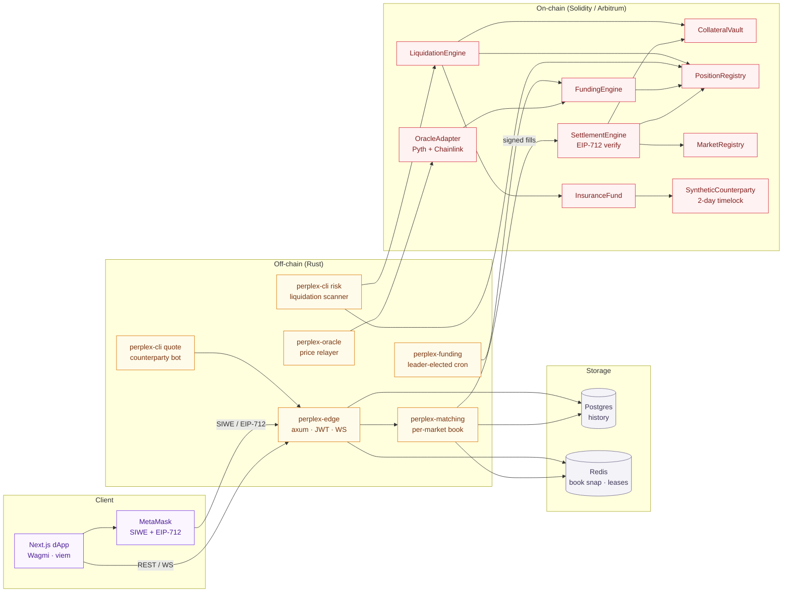
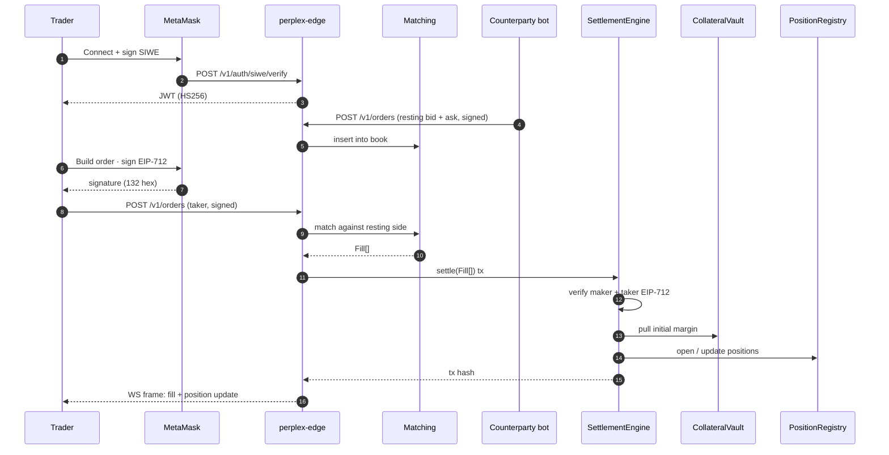
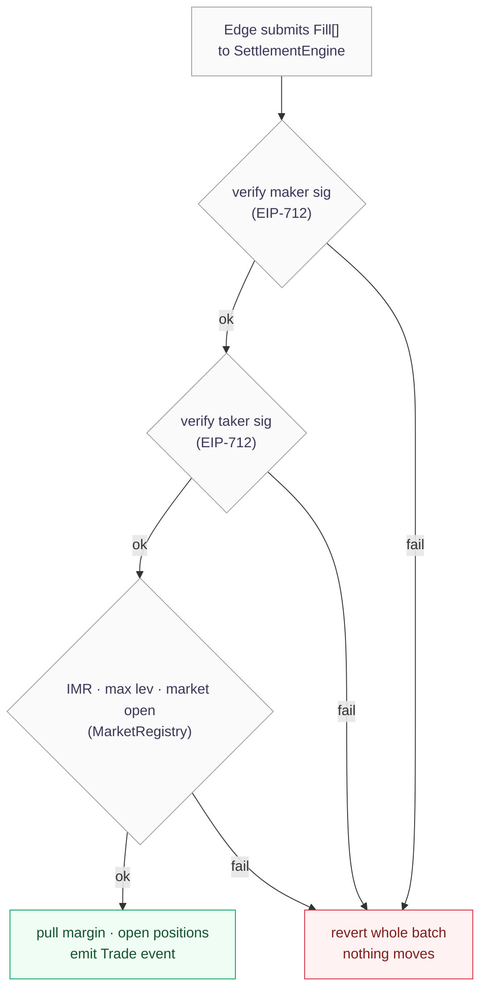

<div align="center">


# Perplex

**A dYdX-class decentralised perpetual-futures exchange.**
Orderbook-matched. USDC-collateralised. Self-custodial. Built for Arbitrum.

[](LICENSE)
[](contracts/)
[](crates/)
[](web/)
[](contracts/)
[](#status)

</div>

---

## What it is

Perplex is a **hybrid perpetual-futures DEX**: an off-chain orderbook matched in Rust for centralised-exchange latency, with every fill settled atomically on-chain in Solidity. Traders keep custody of their USDC; the matching engine never holds funds. The match layer is replaceable — settlement does not trust it.

Three markets ship in v1: `BTC-USD`, `ETH-USD`, `SOL-USD`. Up to 20× leverage, 8h funding cadence, EIP-712 signed batch settlement. The off-chain Pyth Hermes relayer streams live BTC/ETH/SOL prices into the edge in **every** environment (local, testnet, mainnet) — on-chain settlement adds the verified Pyth pull-feed + Chainlink sanity bound on top. A local `MockOracle` and `MockUSDC` make the whole stack runnable on a laptop with `make dev-up` (or `./scripts/dev-up-all.sh` for the one-command path).

---

## Capabilities

- **Self-custodial trading.** USDC stays in `CollateralVault` until the trader signs an EIP-712 fill that the on-chain settlement engine re-verifies. The matching server cannot move funds.
- **CEX-grade latency.** Rust + axum + `tokio` matching engine with a per-market `BTreeMap` orderbook. Benchmarks land in the low millions of ops/sec on a single core.
- **Atomic settlement.** `SettlementEngine` either applies every fill in a batch or reverts the whole batch. No partial fills, no torn state.
- **Live Pyth-driven marks.** `perplex-oracle` relayer streams BTC/ETH/SOL prices from Pyth Hermes every ~500 ms into edge state. Mark price on every position, the trade page header, the chart's live candle, and the market list all source the same tick. A `Pyth` source pill on the trade header makes the live vs static distinction visible at a glance.
- **Cross-margin position aggregates.** `/v1/positions` returns total notional, unrealised PnL, used margin, and free collateral computed at read time against the live mark. Funding rate is derived from the orderbook mid vs index and broadcast on `funding.{marketId}` every 2 s.
- **Slippage-aware order ticket.** Liquidation preview walks the orderbook side for the requested size and uses the volume-weighted entry, so the `Liquidation @ Nx` row moves with both size and leverage — not just leverage.
- **Self-trade prevention.** The edge matcher skips every maker order keyed to the taker's address. Same wallet can't accidentally cross itself and net to zero.
- **Lazy 8h funding.** Cumulative funding index per market. Positions settle their funding obligation on next interaction — O(1) per position, O(1) per window. Next-settlement timestamp is aligned to UTC `00:00 / 08:00 / 16:00`.
- **Liquidation + insurance + ADL.** Underwater positions close at the oracle mark; penalty flows to `InsuranceFund`; auto-deleveraging is the last-resort backstop when the fund is empty.
- **Real-time UI.** Next.js 16 + React 19 + Wagmi v3 frontend with SIWE login, EIP-712 order signing, live orderbook + fills + mark via WebSocket.
- **Local-first dev loop.** `make dev-up` boots Anvil + Postgres + Redis, deploys 11 contracts, seeds prices, mints `MockUSDC` — full stack in under a minute.
- **Observability.** Per-binary Prometheus `/metrics`, auto-provisioned Grafana counterparty dashboard via `make metrics-up`.

---

## Status

A snapshot of what the platform does today versus what stands between it and a live, real-money product — and why.

### What works today

- **Perpetual-futures trading** — live orderbook, matching engine, market + limit orders across BTC-USD, ETH-USD, SOL-USD with up to 20× leverage.
- **Durable state** — orders, positions, fills, balances, public trades, and funding history persist to Postgres and survive a restart with no data loss.
- **Liquidations** — a keeper detects positions below maintenance margin and force-closes them at the oracle mark; real liquidation prices are shown on every position.
- **Risk gate on order entry** — orders are rejected when they aren't backed by enough collateral or would exceed the market's max leverage.
- **Wallet-verified login** — Sign-In-With-Ethereum performs full ECDSA signature recovery, so only the real wallet owner can open a session.
- **Fees + rebates** — taker fees and maker rebates are charged and settled into balances on every fill.
- **Live oracle pricing** — BTC/ETH/SOL marks stream from Pyth Hermes in every environment.

### What does not work yet — and why

| Capability | Why not yet | What it needs |
|---|---|---|
| **Run on a public blockchain** | Runs on a local dev chain (Anvil), not a public network. | Deploy contracts to Arbitrum Sepolia. Currently blocked only on obtaining testnet gas tokens from a faucet — minor. |
| **Handle real money** | Uses test USDC; no real deposits or withdrawals. | A security audit and legal clearance first, then point the vault at real USDC on mainnet. The audit and legal work are the real gatekeepers. |
| **Be reachable on the internet** | Runs only on a local machine; nothing is hosted. | Paid always-on hosting for the backend + database (see below). |
| **Pass a security audit** | No external audit; some hardening still pending (per-order EIP-712 verification, oracle-manipulation guards). | Engage an audit firm — costs money and takes weeks; required before real funds. |
| **Deep, real liquidity** | Only the in-house bot quotes the book. | Recruit external market makers + an incentive program. The fee/rebate rails are already built; this is a business effort, not code. |
| **Operate legally** | Perpetuals are heavily regulated; no entity, geofencing, or terms in place. | A legal entity in a crypto-friendly jurisdiction, region restrictions, and terms of service. Legal, not code. |
| **Run 24/7 reliably** | No always-on host, alerting, or backups. | Hosting + monitoring + database backups. Structured logs and Prometheus metrics are already wired; they just need a host to run on. |

### Hosting — why the live deployment costs money

The engineering is done; making it publicly reachable and always-on is a hosting cost, not a code task.

- **Free tiers don't fit a live exchange.** **Render**'s free tier sleeps after ~15 minutes of inactivity — the whole stack stops until the next request wakes it (slow cold starts, dropped live connections). **Fly.io**'s free allowance is too small to keep the backend + database + keeper always-on. **Vercel** (free) hosts only the frontend, so the site loads but shows no data.
- **Paid, always-on options.** **Railway** (usage-based, ~$5-20/month at this size) runs the backend + Postgres + keeper together and stays awake — best value for a live demo. **Fly.io** (paid, pay-as-you-go) is similarly priced and scales well later.

For a genuinely always-on, shareable URL, expect a modest monthly hosting spend on Railway or Fly.io. Free tiers only suit short, on-demand demos.

---

## Tech stack

| Layer | Stack |
|---|---|
| Smart contracts | Solidity `0.8.24` · Foundry · OpenZeppelin · Solady · `pyth-sdk-solidity` |
| Matching + edge | Rust 2021 · `axum` · `tokio` · `tokio-tungstenite` · `sqlx` · `redis-rs` · `jsonwebtoken` · `k256` |
| Frontend | Next.js 16 (App Router) · React 19 · Wagmi v3 · `viem` · TanStack Query · Zustand · Tailwind v4 · MSW |
| Infra | Docker Compose · Anvil · Postgres 16 · Redis 7 · Prometheus · Grafana |
| Auth | SIWE (EIP-4361) · JWT (HS256) · EIP-712 typed-data order signing |
| Oracles | Pyth Hermes off-chain stream (every environment, ~500ms) · Pyth pull-feed + Chainlink sanity bound on-chain (testnet/mainnet) · `MockOracle` available for deterministic tests |
| Target chain | Arbitrum One (mainnet) · Arbitrum Sepolia (testnet) · Anvil `chainId 31337` (local) |

---

## Architecture

The off-chain layer reads intent, matches, and forwards signed fills. The on-chain layer re-verifies signatures and is the **only** writer of money state.



### Trade lifecycle — one fill, end to end



### Settlement guarantee



---

## Quickstart

Prereqs — Docker Desktop, Foundry (`foundryup`), Rust 1.82+, Node 20+, pnpm 9, `jq`, Python 3.9+ (for `seed-book.py`).

### One-command bring-up (recommended)

```bash
git clone https://github.com/ozpool/Perplex.git perplex
cd perplex
cp .env.example .env
pnpm install --frozen-lockfile
./scripts/dev-up-all.sh
```

Spawns one Terminal window per long-lived process:

1. **Anvil + Postgres + Redis** via `make dev-up` (contracts deployed, `MockUSDC` minted, markets seeded).
2. **perplex-edge** — REST `:8080`, WS `:8081`, with the Pyth Hermes oracle relayer wired in by default. Boot log includes `oracle relayer spawned (Pyth Hermes)`.
3. **perplex-cli quote** — counterparty bot (currently broken under some startup races; `seed-book.py` covers in step 4).
4. **scripts/seed-book.py** — Python dev-stub market maker. Pulls live mid from `/v1/markets` (which carries the Pyth-overlaid `indexPriceX18`) and posts a 5-rung ladder per side every 2s.
5. **Prometheus + Grafana** via `make metrics-up`.
6. **Next.js frontend** via `pnpm web:dev:real` → `http://localhost:3000`.

The script polls `/v1/orderbook/btc-usd` before printing its summary banner, so a green line `btc-usd book has N ask level(s)` confirms everything came up clean.

**Demo wallet (anvil account #5 — import into MetaMask):**

```
addr: 0x9965507D1a55bcC2695C58ba16FB37d819B0A4dc
pk:   0x8b3a350cf5c34c9194ca85829a2df0ec3153be0318b5e2d3348e872092edffba
```

Once SIWE login completes, the edge auto-seeds `100,000 USDC` into your vault (`seed_dev_vault` flag, dev-routes only) so you can place orders immediately — no on-chain deposit needed locally.

### Manual bring-up (advanced)

If you'd rather spawn each piece by hand:

```bash
# 1. Stack
make dev-up

# 2. Edge (oracle relayer included by default; pass --with-oracle=false to skip)
PERPLEX_JWT_SECRET=$(openssl rand -hex 32) \
  cargo run -p perplex-edge -- --bind 127.0.0.1:8080 --ws-bind 127.0.0.1:8081
# REST  http://localhost:8080
# Docs  http://localhost:8080/docs

# 3. Counterparty (the Python stub — perplex-cli quote replaces it once #157 lands)
python3 scripts/seed-book.py

# 4. Metrics
make metrics-up
# Grafana    http://localhost:3001  (admin / admin)
# Prometheus http://localhost:9090

# 5. Frontend
cd web && pnpm dev:real
```

### Verifying live oracle

After bring-up, BTC/ETH/SOL on the trade page should tick every ~500 ms and the MarketHeader Oracle stat carries a green pulsing **Pyth** pill. Confirm from the CLI:

```bash
curl -s http://127.0.0.1:8080/v1/markets \
  | jq '.markets[] | {id, idx: .indexPriceX18, vol: .volume24hUsdc, oi: .openInterestUsdc, fr: .fundingRateBps}'
```

Run twice, ~2 s apart — `idx` changes between calls.

### Tear down

```bash
make dev-down       # stop anvil + postgres + redis (keep volumes)
make metrics-down   # stop prometheus + grafana
make dev-reset      # nuke volumes and re-bootstrap
```

A longer playbook (MetaMask import, dev wallet, every terminal) lives in the [Notion runbook](https://www.notion.so/36c9a63078bd81529f74df2de761fdb5).

### Troubleshooting

- **Position panel empty after a fill** — restart the seeder Terminal so its anvil-#1 maker quotes refresh. Self-trade prevention now blocks fills where taker and maker are the same address; this usually means MetaMask is signing as anvil #1 instead of anvil #5. Re-import the demo wallet pk above.
- **Order rejected `jwt: ExpiredSignature`** — the edge process rotated its JWT secret (e.g. you Ctrl-C'd and restarted it). The FE auto-clears the stale bearer and prompts SIWE again; just sign once more.
- **Trade page shows `static` next to Oracle** — the Pyth Hermes fetch is failing. Check the edge Terminal for `oracle source fetch failed` warnings. Re-running `./scripts/dev-up-all.sh` typically resolves it.
- **`Position panel always empty`** — almost always the self-trade case above. As a sanity check, `curl /v1/orderbook/btc-usd` and confirm both bids and asks have at least one level from `seed-book.py` (anvil account #1, not #5).

---

## Repo layout

```
contracts/             Solidity sources + Foundry tests (unit, invariant, differential)
  src/                 11 contracts (Vault, Registry, Settlement, Funding, Liquidation, Oracle, …)
  lib/                 forge-std, openzeppelin-contracts, solady, pyth-sdk-solidity
  script/              Deploy.s.sol (Anvil + Sepolia)
crates/                Rust workspace
  perplex-core         Shared types + EIP-712 domain + margin math
  perplex-matching     BTreeMap orderbook · per-market workers · fill streams
  perplex-edge         axum REST + WS · JWT · SIWE · OpenAPI (utoipa)
  perplex-oracle       Pyth Hermes source + drift-triggered relayer
  perplex-funding      Redis SETNX leader-election cron
  perplex-mock-oracle  Local replay oracle pusher
  perplex-cli          One bin, many subcommands: edge / quote / oracle / risk / kill / metrics
  perplex-diff-gen     Rust JSON fixtures replayed in Solidity diff tests
web/                   Next.js 16 frontend
  app/(app)/           trade · markets · portfolio · wallet · history
  app/(marketing)/     Public landing
  lib/                 wallet (Wagmi · SIWE) · contracts · ws · api
  styles/              tokens.css (dark + orange theme)
docs/                  openapi.json · postman.json · margin-math.md
infra/                 docker-compose.metrics.yml · Grafana dashboard JSON
scripts/               seed · smoke-deposit · smoke-trade · smoke-liquidate · replay-binance
sdk/                   TypeScript SDK (Phase 5)
Makefile               Top-level commands
```

---

## Component status

| Component | Phase | Status |
|---|---|---|
| `CollateralVault` | 1 | shipped |
| `MarketRegistry` | 1 | shipped |
| `PositionRegistry` (VWAP + health + funding stamp) | 2 | shipped |
| `SettlementEngine` (EIP-712 batched) | 2 | shipped |
| Orderbook + per-market workers | 3 | shipped |
| Differential + invariant tests | 3 | shipped |
| `OracleAdapter` (Pyth + Chainlink sanity) | 4 | shipped |
| `FundingEngine` + Rust SETNX cron | 4 | shipped |
| `LiquidationEngine` + `InsuranceFund` | 4 | shipped |
| ADL socialisation | 4 | shipped |
| REST API (11 endpoints + OpenAPI) | 5 | shipped |
| WebSocket (5 channels, backpressure) | 5 | shipped |
| Counterparty bot (quote agent + kill switch) | 5 | shipped |
| SessionKey contract | 5 | shipped |
| Frontend (Next.js trading UI) | 6 | shipped |
| Redis token-bucket rate limiting | 6 | shipped |
| TypeScript SDK + load test | 7 | pending |
| MegaVault LP backstop | 7 | pending |
| Arbitrum Sepolia bringup | 8 | pending |
| External audit + mainnet rollout | 9 | pending |

---

## Testing

```bash
forge test                        # 164 unit + invariant + differential
cargo test --workspace            # Rust crates
cargo clippy --workspace --all-targets -- -D warnings
forge fmt --check && cargo fmt --all -- --check
```

Differential tests replay 500 Rust-generated scenarios on-chain with a 256-wei tolerance for `Decimal`-vs-integer rounding. Invariants run 256 fuzz rounds × 16384 calls each and assert:

- per-market sum of position sizes = 0
- cumulative funding cashflow nets to dust
- insurance fund balance is monotonic in the absence of bad debt

End-to-end smokes:

```bash
make dev-deposit      # deposit / withdraw / blocked-withdraw path
make dev-trade        # place + match + settle
make dev-liquidate    # crash price · verify liquidation cascade
make sim-replay       # 30-day Binance tape against the counterparty agent
```

---

## API

REST surface is the source of truth for the frontend — every endpoint is documented in `docs/openapi.json`, auto-derived via `utoipa`, and served at `http://localhost:8080/docs`. A Postman collection is exported to `docs/postman.json`.

| Method | Path | Auth | Purpose |
|---|---|---|---|
| `POST` | `/v1/auth/siwe/nonce` | public | start SIWE login |
| `POST` | `/v1/auth/siwe/verify` | public | finish SIWE, mint JWT |
| `GET`  | `/v1/markets` | public | list markets |
| `GET`  | `/v1/orderbook/:market_id` | public | orderbook snapshot |
| `GET`  | `/v1/trades/:market_id` | public | recent fills |
| `GET`  | `/v1/funding/:market_id` | public | funding rate history |
| `POST` | `/v1/orders` | bearer | place signed order |
| `DELETE` | `/v1/orders/:order_id` | bearer | cancel |
| `GET`  | `/v1/orders/open` | bearer | open orders |
| `GET`  | `/v1/positions` | bearer | open positions |
| `GET`  | `/v1/fills` | bearer | private fills |
| `GET`  | `/v1/account/balance` | bearer | vault balance |

### WebSocket channels

| Channel | Auth | Payload |
|---|---|---|
| `orderbook.{marketId}` | public | snapshot + deltas with sequence |
| `trades.{marketId}` | public | public fills |
| `oracle.{marketId}` | public | live Pyth Hermes mark-price ticks (~500ms) |
| `funding.{marketId}` | public | funding rate (bps) + next-settlement nanos (2s ticker) |
| `user.fills` | bearer | private fills |
| `user.positions` | bearer | private position diffs |

Subscribe over the framed `op` protocol:

```json
{ "op": "auth", "token": "<jwt>" }              // only for bearer channels
{ "op": "subscribe", "channel": "oracle.btc-usd" }
{ "op": "unsubscribe", "channel": "oracle.btc-usd" }
```

The edge publishes every message verbatim — clients filter by `type` (e.g. `oracle`, `funding`, `trade`).

---

## Roadmap

- **v1.0 (current)** — local-first hybrid DEX. 3 markets. Full settle / fund / liquidate / ADL cascade. Self-host with one Make target.
- **v1.1** — Arbitrum Sepolia bringup. Pyth Hermes wired live. MegaVault LP backstop. Auto-liquidation watcher. SessionKey UX so MetaMask doesn't prompt per order.
- **v2.0** — Arbitrum One mainnet. External audit. More markets. Cross-margin. SDK on npm.

---

## Contributing

- Every change lands via PR. Contributors do not push to `main`.
- Branch naming: `feat/<name>`, `fix/<name>`, `chore/<name>`, `docs/<name>`.
- CI (Foundry + Cargo + devnet smoke) must be green before review.
- Branches are preserved on merge — never `--delete-branch`.
- Commits use a verb-first imperative subject.

See [`CONTRIBUTING.md`](CONTRIBUTING.md) for the full development loop.

---

## License

[BUSL-1.1](LICENSE) (source-available). Converts to MIT once Stage-3 mainnet is stable.
